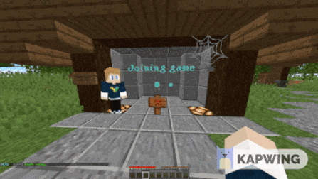

  
  <h1>Awesome Plugins 🏝️</h1>
  

  Do you want to <b>build</b> a modern, fancy <b>server</b> (like <b>MCC Island</b> or <b>Cytooxien</b>) but struggle to find the right resources?
  

 

  
Here you will find a list of my favorite <b>Minecraft plugins</b>, tools, and resources. 
  Most of them are <b>free</b>, <b>open-source</b> and support the <b>latest Minecraft version.</b>

# Table of Contents

- [Plugins](#plugins)
  - [Fancy](#fancy-plugins)
    - [Without Resourcepack](#no-resourcepack)
    - [Resourcepack Required](#resourcepack-required)
  - [Essential](#essential-plugins)
- [Libraries & API's (Do not work standalone)](#libraries--apis)
- [Server Software](#server-software)
  - [Based on Paper](#paper-based)
  - [Other](#other-server-software)
- [Resourcepack](#resourcepack)
  - [Shaders](#shaders)
  - [Packs](#packs)
  - [Plugins & Libraries](#plugins-libraries)
- [Proxy](#proxy)
  - [Software](#software)
  - [Plugins](#plugins)
- [Tools](#tools)
- [Resources](#resources)
  - [Performance](#performance)
  - [Other](#other-resources)

# Plugins

## Fancy plugins

### No resourcepack

<h2>FancyPhysics [FREE]</h2>

Adds funny Minecraft physics effects. Tree fall animation, damage particles, realistic explosions, visual crafting & more

  
  
  
  

<h2>ProdigyCape [FREE]</h2>

The most realistic cape plugin for your Minecraft server

  
  
  

<h2>BetterChatBubbles [PAID]</h2>

Packet-based chat bubbles above players' heads

  
  
  </a>
  

<h2>EntitySize [FREE]</h2>

Change the size/scale of any living entity or player with an optional transition

  
  
  </a>
    
  

<h2>BiomeManager [PAID]</h2>

Change the color/sounds/particles of grass/leaves/water/fog/sky

  
  
  </a>
  

<h2>AdvancedGUI [PAID]</h2>

Create truly interactive itremframe GUIs with an intuitive web editor

  
  
  </a>
  

## Essential Plugins

<ul>
<li>
<h3>FastAsyncWorldEdit [FREE]</h3>

Blazingly fast world manipulation for builders WorldEdit but better

  
  
  </a>
  

</li>

  <li>
    <h3>LuckPerms [FREE]</h3>
    
Permissions plugin for managing ranks and permissions

    

      
      
      
    

  </li>

  <li>
    <h3>AntiHealthIndicator [FREE]</h3>
    
Enhance fairness with AntiHealthIndicator! Lightweight, async packet spoofing for gameplay integrity

    

      
      
            
    

  </li>

  <li>
    <h3>Better Flowers [FREE]</h3>
    
A useful Minecraft building tool, that let's you place customized flowers

    

      
      
            
    

  </li>

  <li>
    <h3>CustomScoreNumbers [FREE]</h3>
    
Remove/hide the red numbers in the scoreboard or change the color

    

      
      
      </a>
            
    

  </li>

  <li>
    <h3>Better Build [FREE]</h3>
    
A useful Minecraft building tool, that manages the server on which you build

    

      
            
    

  </li>

   <li>
    <h3>Citizens 2 [FREE & PAID]</h3>
    
The Best NPC Plugin

    

      
            
      </a>
            
      </a>
            
    

  </li>

   <li>
    <h3>NoDirectionalDamageTilt [FREE]</h3>
    
Disable the "new" 1.19.4 directional damage animation

    

      
      
            </a>
            
    

  </li>

  <li>
    <h3>PassengerAPI [FREE]</h3>
    
Fix passenger compatibility issues | Manage your own entity passengers

    

      
      
      
    

  </li>

  <li>
    <h3>Chunky [FREE]</h3>
    
Pre-generates chunks, quickly, efficiently, and safely

    

      
      
      
    

  </li>

  <li>
    <h3>TerraformGenerator [FREE]</h3>
    
A nice custom world terrain generator

    

      
      
      
    

  </li>
</ul>

# Libraries & API's

- [**PacketEvents**](https://github.com/retrooper/packetevents): a powerful tool for mastering Minecraft packet manipulation with speed and finesse. The best ProtocolLib alternative
- [**EntityLib**](https://github.com/Tofaa2/EntityLib): Additional features to PacketEvents like EntityMeta.
- [**ChatBubbles-API**](https://github.com/max1mde/ChatBubblesAPI): The official API of the plugin Better Chat Bubbles.
- [**HologramAPI**](https://github.com/max1mde/HologramAPI): Packet-based text display hologram API with MiniMessage and emoji support.
- [**Lamp**](https://github.com/Revxrsal/Lamp): A modern annotation-driven commands framework for Java and Kotlin.
- [**CommandAPI**](https://github.com/CommandAPI/CommandAPI): A Bukkit/Spigot API for the command UI introduced in Minecraft 1.13.
- [**creative**](https://github.com/unnamed/creative): A resource-pack library for Minecraft: Java Edition.
- [**Simple-YAML**](https://github.com/Carleslc/Simple-YAML): A Java API providing an easy-to-use way to store data and configurations using the YAML format.
- [**Scoreboard Library**](https://github.com/MegavexNetwork/scoreboard-library): A library for Paper/Spigot servers to handle packet-level scoreboards. 

## Paper-Based  

- [**Paper**](https://papermc.io/): Optimized server software with significant performance improvements over Spigot.  

- [**Purpur**](https://github.com/PurpurMC/Purpur): Extended Paper with additional features and customization options.  
- [**Pufferfish**](https://github.com/pufferfish-gg/Pufferfish): A fork of Paper focused on performance enhancements and reducing lag.  
- [**Airplane**](https://github.com/TECHNOVE/Airplane): A lightweight Paper fork designed for high-performance servers with better TPS optimization.  
- [**Folia**](https://github.com/PaperMC/Folia): A fork of Paper supporting regionized multithreading for improved performance on large servers.  

## Other Server Software  
- [**Limbo**](https://github.com/LOOHP/Limbo): A lightweight, customizable server software ideal for lobby servers with no actual world.   

# Resourcepack

## Shaders

### Learning
https://github.com/McTsts/Minecraft-Shaders-Wiki
https://github.com/bongbongsaysbong/Common-Shaders
https://github.com/McTsts/mc-core-shaders

### Some shaders

- [**Vanilla Shaderpack**](https://github.com/JNNGL/vanilla-shaderpack): An attempt to create a decent looking shader using the vanilla pipeline.  
- [**Vanilla Shaders**](https://github.com/JNNGL/vanilla-shaders): Vanilla shaders for motion blur, colored lights, and more.  
- [**VanillaDI**](https://github.com/JNNGL/VanillaDI): Dynamic colored lights.  
- [**Light Painter**](https://github.com/bradleyq/light_painter): Screen space point lights using Minecraft's exposed transparency shaders.  

## Packs

## Plugins & Libraries

# Proxy

Seems like there are some usefull plugins:  
https://github.com/orgs/Elytrium/repositories

## Software
- [**Velocity**](https://github.com/PaperMC/Velocity): A modern, fast, and flexible Minecraft proxy for connecting multiple servers

## Plugins

# Tools
- [**Image to TextDisplay**](https://github.com/META-Tommy/Image-To-Text_Display): Convert an image to a text_display entity in Minecraft: Java Edition
- [**Stable Player Display**](https://github.com/bradleyq/stable_player_display): Models + shaders to display player models using new item_display entites
- [**All Spigot NMS**](https://github.com/Jacxk/all-spigot-nms): All NMS versions of bukkit/spigot in one jar file. NMS from 1.8-1.17

# Resources

## Performance
- [**Minecraft server optimization guide**](https://github.com/YouHaveTrouble/minecraft-optimization) How to optimize the performance of your Minecraft server by changing certain settings & more

## Other Resources
