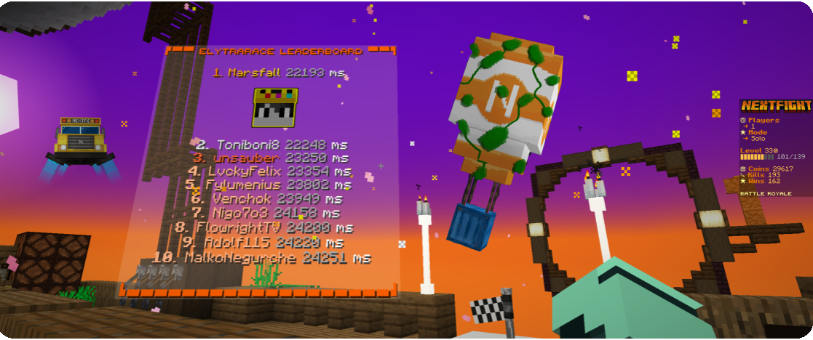

  <h1>Awesome Plugins 🏝️</h1>
  

  Do you want to build a <b>modern, fancy server</b> (like <b>MCC Island</b> or <b>Cytooxien</b>) but struggle to find the right resources?
  

 

  
Here you will find a list of my favorite <b>Minecraft plugins</b>, tools, and resources. 
  Most of them are <b>free</b>, <b>open-source</b> and support the <b>latest Minecraft version.</b>

# Table of Contents

- [Plugins](#plugins)
  - [Fancy](#fancy-plugins)
    - [Without Resourcepack](#no-resourcepack)
    - [Resourcepack Required](#resourcepack-required)
  - [Essential](#essential-plugins)
- [Libraries & API's (Do not work standalone)](#libraries--apis)
- [Server Software](#server-software)
  - [Based on Paper](#paper-based)
  - [Other](#other-server-software)
- [Resourcepack](#resourcepack)
  - [Shaders](#shaders)
  - [Packs](#packs)
  - [Plugins & Libraries](#plugins-libraries)
- [Proxy](#proxy)
  - [Software](#software)
  - [Plugins](#plugins)
- [Tools](#tools)
- [Resources](#resources)
  - [Performance](#performance)
  - [Other](#other-resources)

# Plugins

## Fancy plugins

### No resourcepack

<h2>FancyPhysics [FREE]</h2>

Adds funny Minecraft physics effects. Tree fall animation, damage particles, realistic explosions, visual crafting & more

  
  
  
  

<h2>ProdigyCape [FREE]</h2>

The most realistic cape plugin for your Minecraft server.

  
  
  

<h2>BetterChatBubbles [PAID]</h2>

Packet-based chat bubbles above players' heads.

  
  
  </a>
  

<h2>EntitySize [FREE]</h2>

Change the size/scale of any living entity or player with an optional transition.

  
  
  </a>
  

<h2>BiomeManager [PAID]</h2>

Change the color/sounds/particles of grass/leaves/water/fog/sky.

  
  
  </a>
  

## Essential Plugins

- **FastAsyncWorldEdit**: Like WorldEdit but with better performance.
- **LuckPerms**: Permissions plugin for managing ranks and permissions.
- **AntiHealthIndicator**: Enhance fairness with AntiHealthIndicator! Lightweight, async packet spoofing for gameplay integrity.
- **CustomScoreNumbers**: Remove/hide the red numbers in the scoreboard or change the color
- **NoDirectionalDamageTilt**: Disable the "new" 1.19.4 damage animation
- **PassengerAPI**: Fix passenger compatibility issues | Manage your own entity passengers

# Libraries & API's

- **EntityLib** Additional features to PacketEvents like EntityMeta.
- **PacketEvents** Good ProtocolLib alternative
- **ChatBubbles-API**: The official API of the plugin Better Chat Bubbles.
- **HologramAPI**: Packet-based text display hologram API with minimessage and emoji support.
- **Lamp**: A powerful, extendable, flexible yet simple to use commands annotation framework.
- **CommandAPI**: A Bukkit/Spigot API for the command UI introduced in Minecraft 1.13.
- **Resourcepack-Library**: A resource-pack library for Minecraft: Java Edition.
- **Simple-YAML**: This Java API provides an easy-to-use way to store data and provide configurations using the YAML format.

# Server Software

## Paper based

- **Paper**: Optimized server software with performance improvements.
- **Purpur**: Extended Paper with extra features.

## Other server software

# Resourcepack

## Shaders

- **Vanilla Shaderpack**: An attempt to create a decent looking shader using the vanilla pipeline.
- **Vanilla Shaderpack2**: Another shaderpack attempt, designed to enhance the vanilla Minecraft graphics.

## Packs

## Plugins & Libraries

# Proxy

## Software

## Plugins

# Tools

# Resources

## Performance

## Other Resources
